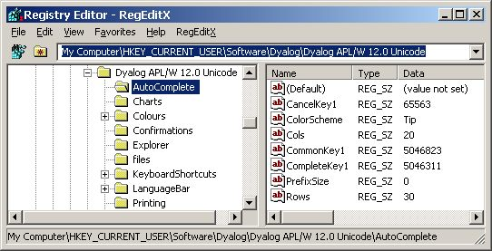

# Dealing with the Windows Registry


## Overview

This class offers methods useful to deal with the Windows Registry without using .NET. It uses `⎕NA` calls to the appropriate Windows API.

`WinReg` is a powerful class that offers plenty of methods. If you just want to read, write and/or delete values from the Windows Registry then the much smaller class [WinRegSimple](https://github.com/aplteam/WinRegSimple) might be sufficient.


## Terminology

To understand the names of the methods you need to understand the terminology. If you find the terminology strange: so do I, but it was invented by Microsoft and therefore defines the standard. That is the reason why I decided to go for it: it makes it easier to understand the Microsoft documentation but also to understand others while talking about the Windows Registry.

In this picture:



you can see this string:

```
HKEY_CURRENT_USER\Software\Dyalog\Dyalog APL/W 12.0 Unicode\AutoComplete
```

at the top of the window.


### HKEY_CURRENT_USER
This is called a "Main key". There are a number of pre-defined main keys available you can choose from. There is also a shortcut available: instead of '''HKEY_CURRENT_USER''' you can use '''HKCU'''.


### SOFTWARE\Dyalog\Dyalog APL/W 12.0 Unicode

This is called a '''sub key'''.

On the right side you see a list. The entries in this list are called _values_. Therefore "CancelKey1" is a value.

Note that the _names_ are called _values_; the actual data saved under a value is called _data_.


## Shared Methods

```
Close
CopyTree
DeleteSubKey
DeleteSubKeyTree
DeleteValue
DoesKeyExist
DoesValueExist
Close               
CopyTree            
Copyright           
DeleteSubKey        
DeleteSubKeyTree    
DeleteValue         
DoesKeyExist        
DoesValueExist      
GetAllSubKeyNames
GetAllValueNames
GetAllValues
GetDyalogRegPath
GetErrorAsStringFrom
GetString
GetTree
GetTreeWithValues
GetTypeAsStringFrom
GetValue
History
KeyInfo
ListError
ListReg
OpenAndCreateKey
OpenKey
PutBinary
PutString
PutValue
ReadByte
```


## Restrictions

Note the following restrictions:

 * `PutValue` supports DWORDs (REG_DWORD)
 * `PutBinary` supports REG_BINARY 
 * `PutString` and `GetString` support strings (REG_SZ), nested strings (REG_MULTI_SZ) and expanded strings (REG_EXPAND_SZ)
 * `GetValue` supports all data types.

Other data types can be requested via `GetValue`; however, writing them is not supported.